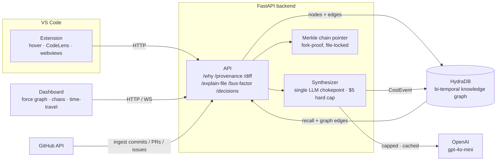

# CodebaseOS

[](https://github.com/sagarbpatel31/CodeBaseOS/actions/workflows/ci.yml)
[](https://marketplace.visualstudio.com/items?itemName=CodeBaseOS.codebaseos)

> **Right-click any line. Ask why. Get the full origin story across commits, PRs, issues, and decisions — in 200ms.**

Built for **Agents Under Pressure — Build your own OS** (AI Valley, 48-hour hackathon).

## Quick start

```bash
make setup          # deps (python venv + extension + dashboard)
make demo           # offline demo → http://localhost:3000 (no creds, Merkle green)
```

Or live against HydraDB (needs `.env` — see `.env.example`):

```bash
make backend        # FastAPI on :8000
make dash           # dashboard on :3000
make ingest REPO=tokio-rs/tokio
make verify         # ✓ Merkle chain intact
```

See `DEMO.md` for the full walkthrough.

---

## Use it on your own repo

> **Best on small-to-medium repos.** CodebaseOS ingests a small repo *completely*
> in seconds and shows you the coverage (`✓ complete: 38/38 commits`). Large
> repos are **sampled** (latest N) and flagged honestly — still useful, just not
> a full mirror. Pick a small repo to see it shine.

Three steps:

1. **Install the extension** — search "CodebaseOS" in VS Code, or
   `code --install-extension CodeBaseOS.codebaseos`.
2. **Start the backend** — `make backend` (needs `HYDRADB_API_KEY`,
   `OPENAI_API_KEY`, `GITHUB_TOKEN` in `.env`). The extension talks to it at
   `http://localhost:8000` (configurable via `codebaseos.backendUrl`).
3. **Ingest** — either:
   - in VS Code, run **`CodebaseOS: Ingest this repo`** (repo auto-detected), or
   - from a terminal: **`cbos ingest owner/small-repo --auto`** — `--auto` sizes
     the ingest to the repo: small repos ingested fully, large ones sampled.

Now, in any file:

- **Hover a line** or click the **🧬 Why? · 📜 Origin story** CodeLens → a
  graph-grounded answer with **clickable links to the real PR / commit / issue**.
- **CodebaseOS: Explain this file** → what it does, who owns it, key decisions.
- **CodebaseOS: What changed** → everything that touched it in a date range.
- **CodebaseOS: Bus factor** → who holds the knowledge, and the risk if they leave.
- Any answer → **Copy as Markdown** to paste into a PR or doc.

No graph database to operate, no query language to learn — just ask.

---

## Architecture



- **Ingestion** pulls commits, PRs, issues, reviews and people from GitHub into
  a **bi-temporal** graph in HydraDB; every write extends a **Merkle chain**
  (verifiable, tamper-evident).
- **All LLM calls** funnel through one **Synthesizer** with a hard **$5 cap** and
  response caching; every paid call logs a `CostEvent` to the graph.
- The **extension** and **dashboard** only ever talk to the backend over HTTP —
  no secrets in the client.

---

## The Problem

Every engineer has asked *"why is this code here?"* and gotten silence.

The senior who made the decision left two years ago. The PR thread is buried under 8,000 newer PRs. The Slack message explaining the reasoning is in a deleted channel. The original ticket is closed.

GitHub blame shows *who* changed it. AI assistants guess. Neither knows *why*.

---

## What CodebaseOS Does

CodebaseOS is a VS Code extension backed by a **bi-temporal HydraDB graph** that ingests your entire repository history — commits, PRs, issues, code review threads, Slack discussions, people — and answers *"why is this code here?"* with a full 14-hop provenance chain, in your editor, in under 200ms.

```
Right-click verify_token() →

"This exists because Decision #482 (Mar 14, 2023): Adopt JWT-based auth.
 Made by: Alice Smith (no longer at company)
 Rationale: 'Stateless verification needed for the multi-region rollout'
 Superseded: Decision #361 (OAuth-session hybrid)

 Decision #482 was made in PR #1872 ('Replace session auth with JWT')
 triggered by Issue #1645 ('Session affinity breaks on region failover')
 after a Slack incident thread in #infra-alerts (87 messages, Mar 9 2023)."
```

---

## Why HydraDB

Vector DBs cannot do this. CodebaseOS requires:

| Capability | Why it matters |
|---|---|
| **Bi-temporal queries** | "What did we know, and when?" — `tx_time` + `valid_time` on every node |
| **Supersession traversal** | Follow Decision → supersedes → Decision chains across years |
| **Multi-tenant** | Multiple repos share a graph; cross-repo people nodes |
| **Sub-200ms traversal** | 14-hop provenance at interactive speed |

A vector DB returns plausible-sounding attributions. The graph returns the correct one — including superseded decisions the vector index can't distinguish.

---

## Architecture

```
╔═══════════════════════════════════════════════════════╗
║              VS CODE EXTENSION (TypeScript)            ║
║  Hover provider · Code lens · Why panel · Status bar   ║
╠═══════════════════════════════════════════════════════╣
║              BACKEND (Python asyncio + FastAPI)        ║
║  /why · /five-whys · /provenance · /status · /verify  ║
║  Ingestion pipeline · Entity resolver · Synthesizer   ║
╠═══════════════════════════════════════════════════════╣
║              HYDRADB BI-TEMPORAL GRAPH                 ║
║  Files · Commits · PRs · Issues · Decisions · People  ║
║  Merkle chain · Supersession edges · Entity resolution ║
╠═══════════════════════════════════════════════════════╣
║  WEBHOOKS: GitHub · Slack (opt) · Linear/Jira (opt)   ║
╚═══════════════════════════════════════════════════════╝
         ┌─────────────────────────────────────┐
         │  OBSERVABILITY DASHBOARD (Next.js)   │
         │  Live graph · Cost meter · Time-travel│
         │  Merkle badge · Chaos buttons        │
         └─────────────────────────────────────┘
```

---

## Key Features

### The Why Panel
Right-click any symbol → full provenance chain rendered in a side panel. Every hop is clickable: PR → Issue → Slack thread → Person. Decisions are attributed to people, not usernames.

### Multi-source Entity Resolution
"Alice on GitHub" linked to "alice.smith@company.com on Slack" to "@alice in Linear" — one `Person` node across all platforms. Three-layer approach: deterministic → heuristic → LLM-assisted (bounded at $1/repo).

### Cryptographic Merkle Provenance
Every ingestion Episode extends a Merkle chain. Tamper with the graph → integrity badge turns red → click to find the broken Episode. History is tamper-evident.

### Bi-temporal Graph
Every node has `tx_time` (when we learned it) and `valid_time` (when it was true). Time-travel slider: drag back 6 months and query the codebase as it was.

### Cost Discipline
Hard $5 inference budget. Live cost meter in the VS Code status bar: `CBOS: $0.34 / $5.00 · 12,847 nodes · Merkle ✓`. Single synthesizer chokepoint — the only place that calls the LLM.

### "Without HydraDB" Mode
Toggle in the dashboard flips to a vector-RAG baseline using the same source data and the same model. Same question, visibly inferior answer. The graph is the moat.

---

## The Demo (5 minutes)

1. **Live ingestion** — ingest `tokio-rs/tokio` (~10K commits) on stage. Graph fills in real-time.
2. **The Why panel** — open VS Code, right-click `task::spawn`. 14-hop provenance chain in 200ms.
3. **Chaos** — judge presses "Tamper with graph" → Merkle badge turns red. "Rewind 6 months" → historical provenance. "Author goes nuclear" → 47 functions trace to someone unreachable.
4. **Without HydraDB** — same line, same question. Vector-RAG returns a wrong attribution. Flip back.
5. **Close** — status bar: `$3.47 / $5.00`. "Real product. Real codebase. Three dollars."

---

## Tech Stack

| Layer | Choice |
|---|---|
| Extension | VS Code Extension API + TypeScript |
| Backend | Python 3.12 + FastAPI + asyncio |
| Graph | HydraDB (bi-temporal + supersession) |
| LLM | GPT-5.4 Mini (synthesizer + entity resolution) |
| Vector baseline | OpenAI embeddings + FAISS (in-memory) |
| Tree parser | tree-sitter (rust, python, typescript, go) |
| Dashboard | Next.js 15 + Tailwind + react-force-graph-2d |

---

## Cost Budget

| Bucket | Estimate |
|---|---|
| Why panel queries (300 × $0.003) | $0.90 |
| Five-whys queries (50 × $0.015) | $0.75 |
| Counterfactual (20 × $0.05) | $1.00 |
| NL search (50 × $0.005) | $0.25 |
| Decision extraction (~50 PRs × $0.01) | $0.50 |
| Entity resolution LLM (~100 × $0.01) | $1.00 |
| Embeddings (one-time baseline) | $0.30 |
| Handoff tours (10 × $0.02) | $0.20 |
| **Total** | **$4.90** |

Hard cap enforced in code. No background agents. No continuous re-summarization. Caching makes repeat queries free.

---

## Hackathon

**Event:** [Agents Under Pressure — Build your own OS](https://lu.ma/k0w6dphv) · AI Valley · 48 hours  
**Theme:** Agents under real-world constraints — memory, tools, recovery, adaptation  
**Team:** 1 human + Claude Code in parallel sessions

---

## License

MIT — Sagar Patel, 2026
